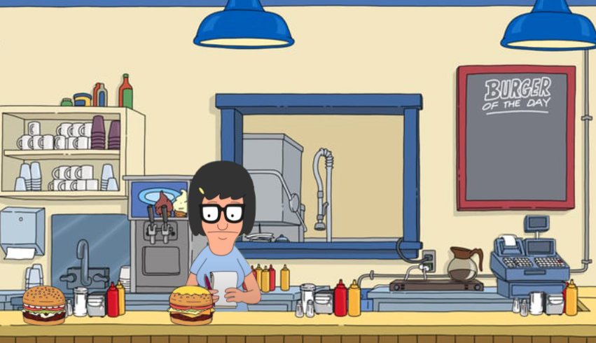

## Bob's Burgers
  
  ****
  

  [USE THE LIVE APPLICATION](https://pacific-sands-36264.herokuapp.com/)

  ### Description
  Fun little burger app that lets the user write and record burger related puns in an interactive environemt. This is a full stack application that uses a SQL database and express server to run the back end and handelbars as a view template on the front end.
  ### Table of Contents
  [Installation](#Installation)
  [Usage](#Usage)
  [Licence](#Licence)
  [Contributing](#Contributing)
  [Tests](#Tests)
  [Questions](#Questions)
  [Project Status](#Project-status)
  
  ### Installation
  If running this on your local machine. You will need to update your database information and run the schema code in order for everything to work properly. You will also need to install the coresponding node packages with the code below
  ```
 npm i 
```
  ### Usage
  Run the code and enjoy the burgers!
  ```
 node server.js 
```

  ### License 
  
  ### Contributing
  George Gombert
  ### Tests
  
  ### Questions or Issues
  If you have any questions or have found issues with the program, please reach out to Bob's Burgers
   [Email](georgegombert@gmail.com)
  
  ### Project Status
  Static website is depoyed. The site is designed for standard web size and is not responsive. The next version of the site will have a mobile component to it in order to bring you Bob's burgers mobile!